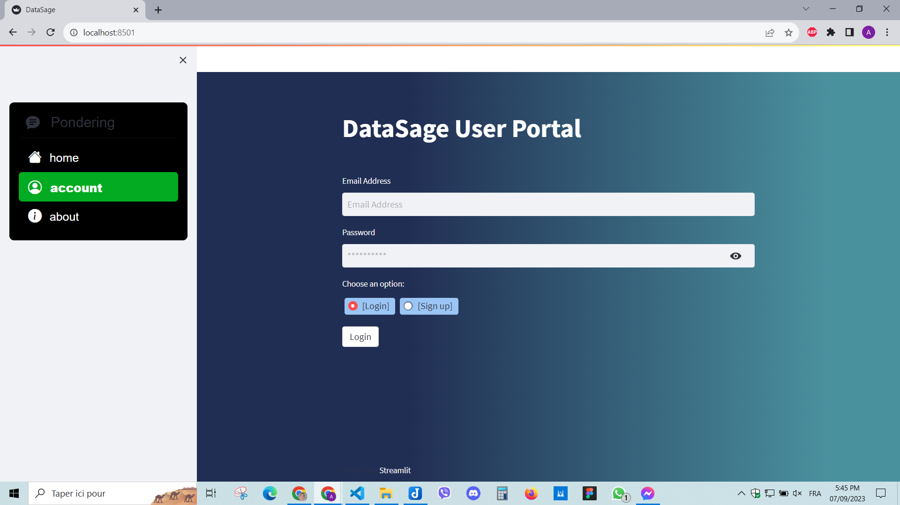
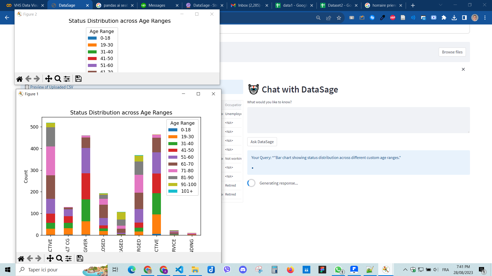
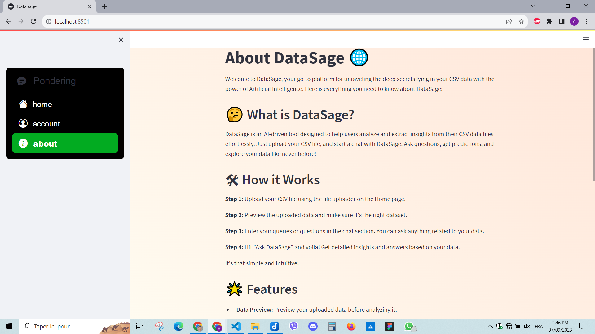

# DataSage 🌐

Demo : 

  
  
  
  
  

## 🤔 What is DataSage?

DataSecho. 2>.gitignore

age is an AI-driven tool designed to help users analyze and extract insights from their CSV data files effortlessly. Just upload your CSV file, and start a chat with DataSage. Ask questions, get predictions, and explore your data like never before!

## 🛠 How it Works

1. **Upload your CSV file**: Use the file uploader on the Home page to upload your CSV data file.
2. **Preview the uploaded data**: Make sure it's the right dataset by previewing it before moving to the analysis phase.
3. **Chat with DataSage**: Enter your queries or questions in the chat section. Feel free to ask anything related to your data.
4. **Get Insights**: Hit "Ask DataSage" and voila! Receive detailed insights and answers based on your data.

Yes, it's that simple and intuitive!

## 🌟 Features

- **Data Preview**: Preview your uploaded data before diving into the analysis.
- **AI-Powered Chat**: A user-friendly chat interface powered by OpenAI to assist you in answering all your data-related queries.
- **Display plots:** You can display any plot of any column (or combination of columns) with a simple prompt with any color you want and any stylings.
- **Secure Authentication**: Our authentication system ensures the utmost protection of your data and preferences.

## 📬 Contact Us

Have questions, suggestions, or feedback? We're all ears! Feel free to reach out to us at pro.belkhoumali.mounaim@gmail.com

---

**Ready to explore your data?** [Start using DataSage now!](link-to-your-app)

© 2023 DataSage | All rights reserved
